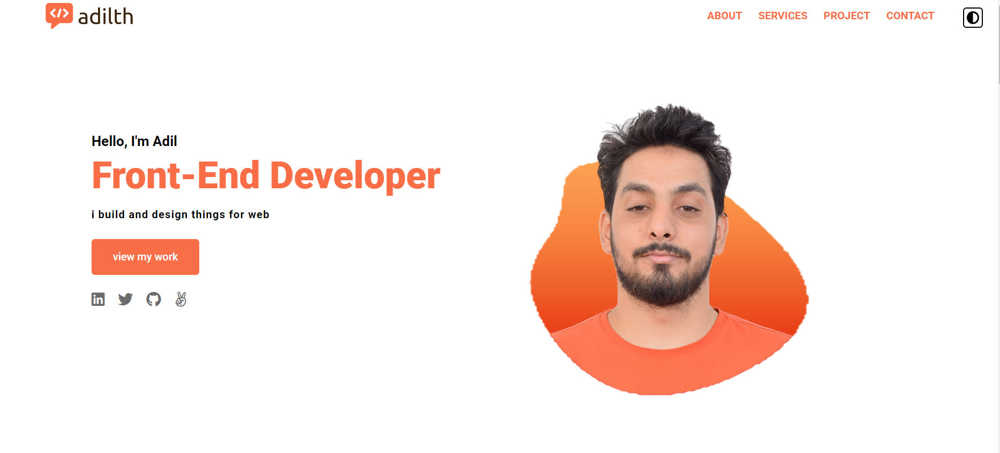

<!-- Social Badge Section -->

## Hi I'm Adil 

- I'm Adil Tahiri a Software Engineer as a Full Stack Web Developer
- based in Marrakech morocco.
- I have extensive knowledge in HTML, CSS, JavaScript, Nodejs, MongoDB,Jest, and React.
- I aspire to help create a new web application and project and bring it to life and demonstrate my commitment to developing
- you can see more info here [My website](https://adilth.netlify.app/)
- Reach me out! rajaadil19952012@gmail.com
   

### Connect

   

<!-- TODO: Add last video link -->

  
<h1 align="center">Technologies</h1>

<!-- TODO: Make technologies links takes you to repositories -->

   

 
 

#### Bizness

- :paperclip: <a href="Downloads\Documents\Adil-tahiri-CV_Software_Engineer (2).docx.pdf" target="_blank"> My resume </a>
- :email: rajaadil19952012@gmail.com

<h1 align="center">Projects</h1>
<table bordercolor="#66b2b2">

<table>
 <tr>
    <td width="50%" valign="top">
      <h3 align="center">My Portfolio</h3>
       
      
       
      

        
        
      

      

        <strong>JavaScript, HTML and CSS</strong> My personal website! Created with a simple stack for optimum performance. Here you can learn more about me, view some of my projects, and reach me through a contact form.
      

    </td>
    <td width="50%" valign="top">
      <h3 align="center">Special tour</h3>
       
      
       
      

        
        
      

      

        <strong>JavaScript, GitHub, HTML, CSS, Bootstrap, jquery,  SVG</strong> - Special tour is a website that shows you the meaning of adventure and explores the word and
                        gives you some excitement to go see it by yourself
      

    </td>
  </tr>
   <tr>
    <td width="50%" valign="top">
      <h3 align="center">pocket Process</h3>
       
      <a href="https://rascaltwo.github.io//" target="_blank">
        <video src="https://user-images.githubusercontent.com/9403665/156878940-b72b7486-179f-4e02-9075-5c9b7ef969ce.mp4" />
      </a>
       
      

        
        
      

      

        <strong>NodeJs, ExpressJs, Chart.js, Ejs, JavaScript, HTML, CSS, and JSON</strong> - It's a website that target people that want to know where there money go and how much
                        is spend in this week , month or year and give a comparison in different dates with a chart
      

    </td>
    <td width="50%" valign="top">
      <h3 align="center">Amina salon</h3>
       
      
       
      

        
        
      

      

        <strong>Javascript, JavaScript, HTML, CSS, JSON, and NPM</strong> - This website build to make anyone can reach and contact the owner and reserve without going to a
                        salon shop and you can check the price and type of style you want
      

    </td>
  </tr>
  <tr>
  <td width="50%" valign="top">
      <h3 align="center">SamiFood Rest&Delivery</h3>
       
      
       
      

        
        
      

      

        <strong>Javascript, React, HTML, CSS, JSON, FireBase,and NPM</strong> -It's is a small restaurant and food Delivery the that you can order food from home and even reserve a table if you want
      

    </td>
  </tr>
</table>

  More stuff about me

 

#### Github Stats

<!--  -->
 

<!--  -->

 

